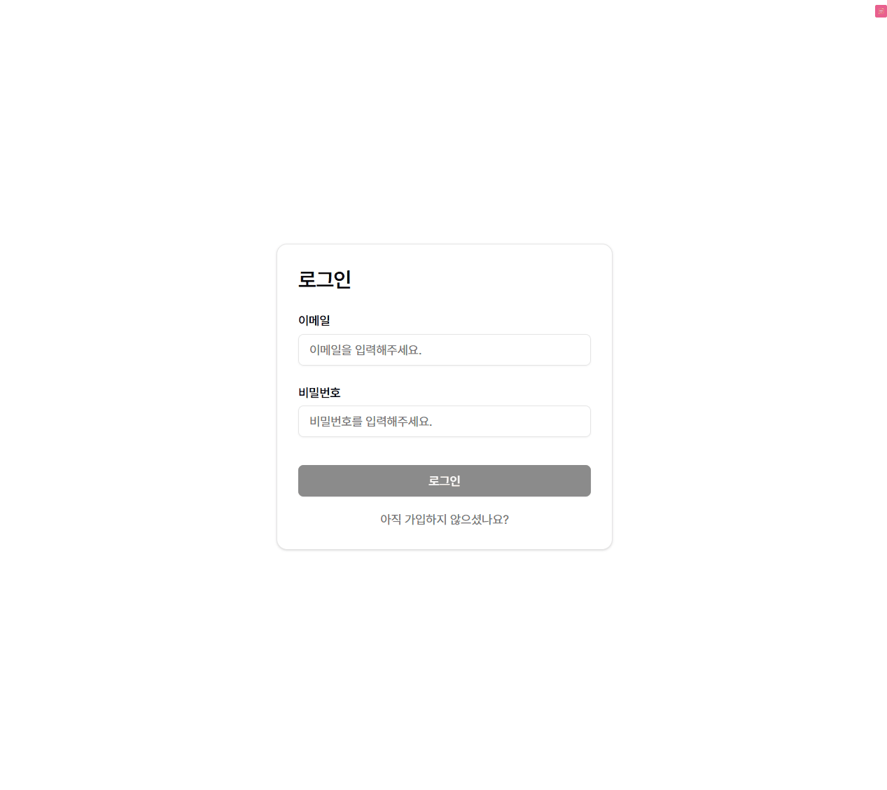

## 원티드 프리온보딩 FE 챌린지 11월



### 실행 방법

백엔드 코드는 [해당 레포지토리](https://github.com/starkoora/wanted-pre-onboarding-challenge-fe-1-api.git)를 클론하여 실행할 수 있습니다.  
프론트엔드 코드는 아래 커맨드를 통해서 실행한 뒤, http://localhost:4173 에서 확인할 수 있습니다.

```sh
pnpm install
pnpm build
pnpm preview
```

### 기술 스택

- TypeScript
- React
- Vite
- TanStack Query
- Tailwind CSS
- shadcn
- react-hook-form
- zod

### 디렉토리 구조

```sh
📁 api
  📁 dtos (Request, Response 타입 정의)
  📁 mutations (Mutation 훅)
  📁 query-options (Query Factory 객체)
  📁 services (REST API 호출 함수)
📁 components
  📁 domain (도메인 맥락이 존재하여 특수한 상황에서 사용하는 컴포넌트)
  📁 feature (형태 없이 기능을 제공하는 컴포넌트)
  📁 ui (공통적으로 사용하는 UI 컴포넌트)
📁 constants
📁 hooks
📁 layouts (공통 레이아웃)
📁 lib (외부 라이브러리의 클라이언트 등 설정)
📁 outlets (라우팅 경로 별 공통 로직)
📁 pages
📁 providers (Context Provider)
📁 schemas (유효성 검증 스키마)
📁 utils
📄 main.tsx
```

### 기능

**로그인 / 회원가입**

- 사용자 인가 여부는 Context API로 관리하며, 각 라우팅 경로 별 라우팅 가드를 구현하여 페이지 별 접근 제어를 관리합니다.
- 입력 양식의 관리를 위해 react-hook-form 을 사용했으며, 유효성 검사 및 유효성 검사 관련 메시지를 단일 지점에서 관리하고자 상수화 및 zod 스키마를 적용했습니다.

**Todo List**

- 할 일의 체크 여부는 브라우저를 종료해도 기억할 수 있도록 로컬 스토리지에 저장하였고, React 렌더링 프로세스와의 동기화를 위해 [useStorageState](https://github.com/astoilkov/use-storage-state)를 활용했습니다.

### 고민점

**API 인터페이스 관련**

- TanStack Query로 데이터 패칭을 관리하는 환경에서 API 관련 인터페이스를 어떻게 정리할지 디렉토리 구조에 대해서 고민중입니다. codegen으로 OAS 기반의 인터페이스를 자동 생성하는 방법도 있겠지만, 만약 해당 방법을 사용하지 못하는 상황이라면 어떻게 DTO 타입 및 API 호출 인터페이스를 수동으로 관리할지 고민중입니다. (Query Invalidation, Optimistic Update의 공통화 등)

**Form 관리 관련**

- 사용자로부터 입력 받은 데이터를 관리하고 필요에 따라서는 값의 변화를 즉시 화면에 반영해야 하기도 하는데, 기본적으로는 `ref` 기반의 비제어 방식으로 동작하지만 `watch` 혹은 `mode` 를 통해 React 렌더링 프로세스와 동기화 되는 제어 방식으로도 활용할 수 있는 `react-hook-form` 이 입력 양식을 자유롭게 관리하는 데 용이하다는 생각을 가지고 있었습니다.
- 그러나 react-router의 `action`, Next.js의 `server action` 등의 기능을 보면서, `form` 요소의 기본 `action` 과 유사한 인터페이스를 차용하는 추세로 나아가려는 것 같아서, 해당 방식에서는 어떻게 React 렌더링 프로세스와 유연하게 결합하여 관리할 수 있을지 고민중입니다.
- 또한, 할 일 수정/삭제 등의 예시가 그러하듯 Create/Update 동작은 높은 확률로 같은 Form을 활용하게 될 가능성이 높은데, Form 관련 컴포넌트의 마크업만 공통화하고, defaultValue 등은 외부에서 주입하는 등 유연하게 결합하는 방법에 대해서 고민중입니다.
